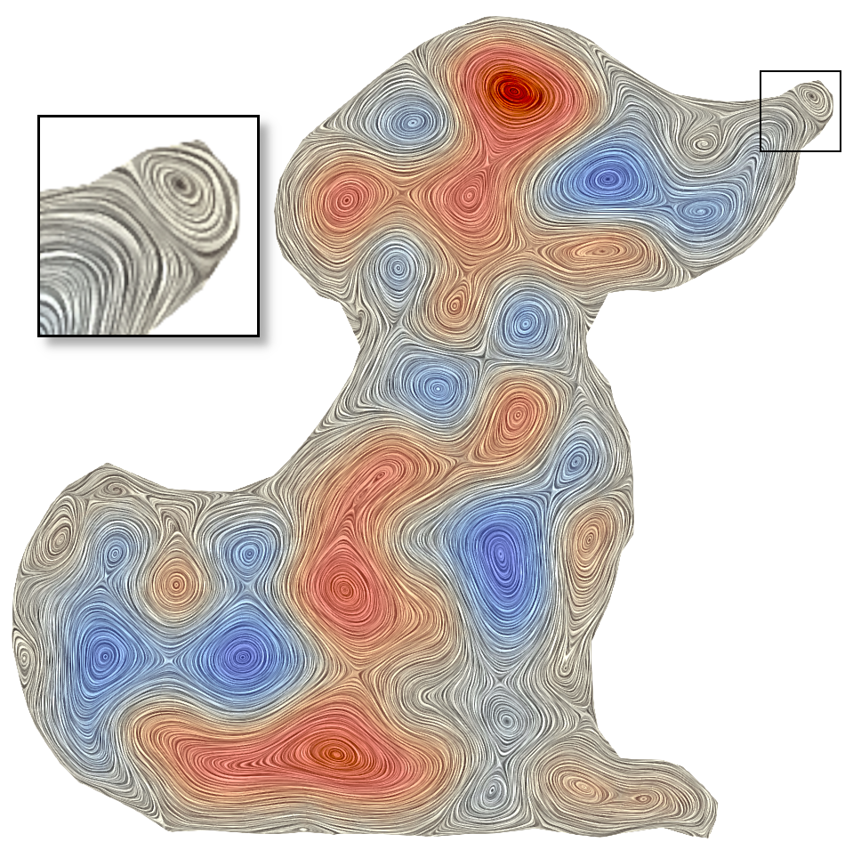

# RBF-PU Curl-Noise

Source code for the method RBF-PU Curl-Noise, presented at SIBGRAPI 2026.

## Paper

> Breno Souza, Luiz Otávio Torarri, Afonso Paiva "RBF-PU Curl-Noise: divergence-free flow for arbitrary domains", SIBGRAPI, 2026.


<p align="center">
  
  
  
</p>

<!--[Paper](link-to-paper) -->

## Overview

RBF-PU Curl-Noise is a meshfree method for approximating divergence-free vector fields from discrete samples of a noise function on planar domains. The method generalizes the construction of synthetic vortical fields via the curl operator to arbitrary domains by differentiating the Radial Basis Function (RBF) interpolant and incorporates a boundary treatment that confines the flow to the interior of unstructured meshes. The estimation of interpolation weights is done via the Partition of Unity (PU) strategy, which naturally parallelizes and simplifies the costly RBF linear system solve. The field evaluation and its posterior differentiation reduce to a simple weighted combination of basis functions.


## Repository Structure
```text
.
├── src/          # Source code
├── meshes/       # Input data
├── experimnts/   # Notebooks with results
└── README.md
```

## Usage

### Requirements

- Python 3.10 or newer
- `pip`
- `venv` (included with Python)

### Setting up the environment

Clone the repository and enter its directory:

```bash
git clone https://github.com/BrenoSS/RBF-PU-Curl-Noise.git
cd RBF-PU-Curl-Noise
```

Create a virtual environment:

```bash
python -m venv .venv
```

Activate the virtual environment.

**Linux/macOS:**

```bash
source .venv/bin/activate
```

**Windows (PowerShell):**

```powershell
.venv\Scripts\Activate.ps1
```

Install the project and its dependencies:

```bash
python -m pip install .
```

The environment is now ready to run the examples. To run the notebooks, make sure to select the venv with the installed project as kernel.

### Using `requirements.txt`

Alternatively, if you prefer to install the dependencies listed in
`requirements.txt`:

```bash
python -m pip install -r requirements.txt
```
